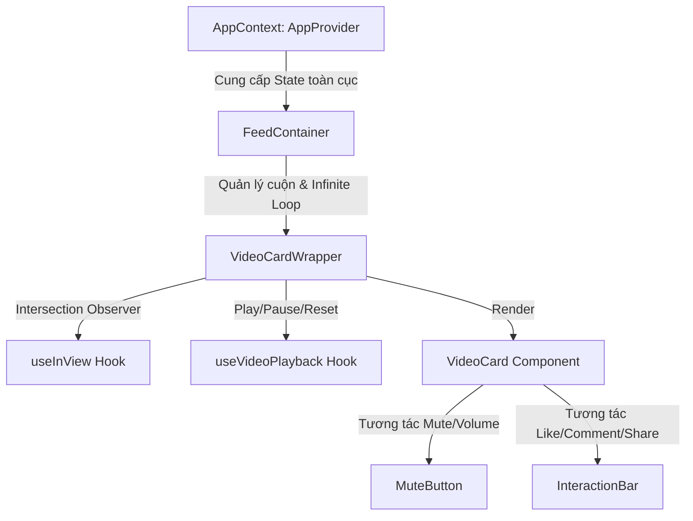

# Báo cáo Kết quả Bài kiểm tra Đầu vào: Vertical Video Feed

## Cơ chế Xử lý Logic Play/Pause khi Cuộn trang (Auto-play/Pause on Scroll)

Để tự động phát hoặc tạm dừng các video tương ứng khi người dùng cuộn qua, hệ thống sử dụng cơ chế xử lý vòng đời hiển thị kết hợp giữa Intersection Observer API và HTML5 Video DOM API:

1. **Nhận diện vùng hiển thị (Viewport Detection):**
   Custom hook `useInView` quản lý một đối tượng `IntersectionObserver` với cấu hình `threshold: 0.6`. Khi thẻ chứa video (`VideoCardWrapper`) đạt trên 60% diện tích hiển thị trong khung nhìn, trạng thái `isInView` sẽ chuyển sang `true`.

2. **Luồng điều khiển Phát video (Play Lifecycle):**
   Khi `isInView` chuyển sang `true`, hook `playVideo` được kích hoạt để gọi phương thức `.play()` trên thẻ video. Nhằm vượt qua chính sách bảo mật chặn âm lượng tự động phát của trình duyệt (Autoplay Policy), nếu Promise trả về lỗi `NotAllowedError`, video sẽ tự động gán cờ `muted = true` và gọi lại `.play()` lần hai để đảm bảo phát thành công.

3. **Luồng điều khiển Tạm dừng & Giải phóng tài nguyên (Pause & Reset Lifecycle):**
   Khi `isInView` chuyển sang `false` (video trượt ra ngoài vùng nhìn), hệ thống lập tức gọi phương thức `.pause()`, đồng thời gán `.currentTime = 0`. Thao tác đưa con trỏ phát về thời điểm bắt đầu giúp trình duyệt giải phóng hoàn toàn vùng nhớ đệm phương tiện (RAM buffer), hạn chế tối đa hiện tượng tràn bộ nhớ đệm gây giật lag khi danh sách cuộn kéo dài vô hạn.

---

Dự án được xây dựng bằng Next.js (App Router) và TypeScript nhằm đáp ứng các yêu cầu trong đề bài kiểm tra năng lực vị trí ReactJS/Next.js Intern. Dưới đây là tài liệu đối chiếu chi tiết các yêu cầu của đề bài và giải pháp kỹ thuật tương ứng đã triển khai.

---

## Bản đồ Đáp ứng Yêu cầu Đề bài (Requirements Mapping)

Dưới đây là bảng đối chiếu trực tiếp giữa các yêu cầu trong đề bài và mã nguồn thực tế của dự án:

### A. Yêu cầu bắt buộc (Core Features)

| STT | Yêu cầu trong đề bài | Vị trí File Code | Giải pháp & Chi tiết Kỹ thuật đã triển khai |
| :--- | :--- | :--- | :--- |
| **A.1** | **Giao diện cuộn dọc (Vertical Scroll Layout)**<br>- Màn hình chiếm toàn bộ khung hình trên di động hoặc cố định tỷ lệ 9:16 ở giữa màn hình nếu xem trên PC.<br>- Áp dụng hiệu ứng cuộn mượt từng video một (Scroll Snap). | - [page.tsx](file:///d:/backup/internship/test/netviet/vertical-video-feed/src/app/page.tsx)<br>- [FeedContainer.tsx](file:///d:/backup/internship/test/netviet/vertical-video-feed/src/components/feed/FeedContainer.tsx)<br>- [globals.css](file:///d:/backup/internship/test/netviet/vertical-video-feed/src/app/globals.css) | - Sử dụng layout responsive chia cột: PC giới hạn khung giữa `lg:max-w-[calc(90vh*9/16)] aspect-[9/16]`; di động kéo dãn full màn hình `h-[100dvh] w-full`.<br>- Triển khai CSS Scroll Snap native (`snap-y snap-mandatory`) giúp cuộn trượt mượt mà từng video một mà không cần sử dụng JavaScript để tính toán vị trí. |
| **A.2** | **Video Player Component**<br>- Gồm: Video element, tên tác giả, mô tả ngắn, dải nút tương tác bên phải (Tim, Bình luận, Chia sẻ).<br>- Click vào video sẽ Play/Pause. | - [VideoCard.tsx](file:///d:/backup/internship/test/netviet/vertical-video-feed/src/components/feed/VideoCard.tsx)<br>- [InteractionBar.tsx](file:///d:/backup/internship/test/netviet/vertical-video-feed/src/components/ui/InteractionBar.tsx) | - Video player hiển thị dưới giao diện overlay tương tác. Đã bọc overlay bằng lớp `pointer-events-none` để click truyền xuống video.<br>- Tách biệt sự kiện click: Click đơn vào video sẽ Play/Pause (kèm hiển thị icon Pause ở giữa màn hình); click nút tương tác được chặn nổi bọt (`e.stopPropagation()`). |
| **A.3** | **Quản lý dữ liệu giả (Mock Data)**<br>- Mảng chứa 3-5 object dữ liệu giả. Gồm: id, videoUrl, authorName, description, likesCount.<br>- Sử dụng các đường dẫn mock video .mp4 được cung cấp. | - [mockVideos.ts](file:///d:/backup/internship/test/netviet/vertical-video-feed/src/data/mockVideos.ts) | - Khai báo cấu trúc dữ liệu kiểu `VideoItem` bằng TypeScript.<br>- Nhập đúng 3 URL video được cung cấp bởi đề bài (Big Buck Bunny, MDN Friday, Sintel Trailer) và gán các trường thông tin mô tả đầy đủ. |

### B. Điểm cộng (Bonus)

| STT | Yêu cầu trong đề bài | Vị trí File Code | Giải pháp & Chi tiết Kỹ thuật đã triển khai |
| :--- | :--- | :--- | :--- |
| **B.1** | **Tự động Play/Pause (Auto-play on scroll)**<br>- Video tự động phát khi cuộn tới và nằm trong tầm nhìn (viewport), tự động dừng khi bị cuộn qua (gợi ý: Intersection Observer). | - [VideoCardWrapper.tsx](file:///d:/backup/internship/test/netviet/vertical-video-feed/src/components/feed/VideoCardWrapper.tsx)<br>- [useInView.ts](file:///d:/backup/internship/test/netviet/vertical-video-feed/src/hooks/useInView.ts)<br>- [useVideoPlayback.ts](file:///d:/backup/internship/test/netviet/vertical-video-feed/src/hooks/useVideoPlayback.ts) | - Viết custom hook `useInView` khởi tạo `IntersectionObserver` ở client-side với tỷ lệ 60% hiển thị.<br>- Khi component hiển thị đủ điều kiện, gọi `.play()` và bắt lỗi để xử lý chính sách Autoplay Policy của trình duyệt; khi trượt qua, gọi `.pause()` và reset `.currentTime = 0` nhằm giải phóng tài nguyên hệ thống. |
| **B.2** | **State Mạng Xã Hội (Like)**<br>- Nút "Tim" (Like) có thể click để đổi màu (đỏ) và tăng/giảm số lượng like. | - [AppContext.tsx](file:///d:/backup/internship/test/netviet/vertical-video-feed/src/context/AppContext.tsx)<br>- [InteractionBar.tsx](file:///d:/backup/internship/test/netviet/vertical-video-feed/src/components/ui/InteractionBar.tsx) | - Quản lý state tim tập trung thông qua global `likes` map ở Context.<br>- Nhấn nút Tim sẽ đảo màu đỏ và cộng/trừ số đếm động. Việc lưu state tập trung giúp thông tin lượt thích không bị mất khi video cuộn đi xa (component bị unmount). |
| **B.3** | **Thanh điều hướng (Sidebar/Bottom Nav)**<br>- Menu cơ bản (Trang chủ, Khám phá, Hồ sơ) mô phỏng UI thật.<br>- Mobile hiển thị ở bottom, PC hiển thị bên trái. | - [Sidebar.tsx](file:///d:/backup/internship/test/netviet/vertical-video-feed/src/components/navigation/Sidebar.tsx)<br>- [BottomNav.tsx](file:///d:/backup/internship/test/netviet/vertical-video-feed/src/components/navigation/BottomNav.tsx) | - Responsive qua class Tailwind:<br>  - PC hiển thị Sidebar bên trái (`hidden lg:flex w-20 xl:w-[250px]`).<br>  - Mobile hiển thị BottomNav dưới cùng (`lg:hidden w-full h-16`). |

---

## Các Giải pháp Kỹ thuật và Tối ưu nâng cao (Premium UX & Code Examples)

Bên cạnh việc giải quyết đầy đủ đề bài, dự án đã triển khai thêm các tối ưu hóa thực tế nhằm cải thiện trải nghiệm người dùng:

### 1. Tự động tương thích tỷ lệ Video (Dynamic Aspect Ratio)
Tính toán tỷ lệ khung hình thực của video tại sự kiện `onLoadedMetadata`. Video ngang (landscape) được gán `object-contain` hiển thị trọn vẹn; video dọc (portrait) được gán `object-cover` tràn viền.

```typescript
const handleLoadedMetadata = (e: React.SyntheticEvent<HTMLVideoElement>) => {
  const videoEl = e.currentTarget;
  if (!videoEl) return;
  const { videoWidth, videoHeight } = videoEl;
  if (videoWidth && videoHeight) {
    const ratio = videoWidth / videoHeight;
    // Tỷ lệ ngang/vuông >= 1.1 dùng contain, ngược lại dùng cover
    setAspectRatioMode(ratio >= 1.1 ? "contain" : "cover");
  }
};
```

### 2. Double Tap to Like (Nhấn đúp để thích)
Tính toán khoảng thời gian giữa hai lần nhấp chuột liên tiếp. Nếu nhỏ hơn 300ms, hệ thống ghi nhận là nhấp đúp, hủy lệnh pause (của nhấp đơn) và hiển thị hiệu ứng trái tim tại vị trí click.

```typescript
const handleVideoClick = (e: React.MouseEvent<HTMLVideoElement>) => {
  const currentTime = Date.now();
  const timeDiff = currentTime - lastClickTimeRef.current;

  if (timeDiff < 300) {
    // 1. Nhấp đúp chuột => Hủy lệnh phát/dừng của nhấp đơn
    if (clickTimeoutRef.current) clearTimeout(clickTimeoutRef.current);
    
    // 2. Lấy tọa độ click tương đối bên trong thẻ video
    const rect = e.currentTarget.getBoundingClientRect();
    const x = e.clientX - rect.left;
    const y = e.clientY - rect.top;

    // 3. Spawns trái tim và kích hoạt tăng tim
    setHearts((prev) => [...prev, { id: Date.now(), x, y }]);
    if (!likes[video.id]?.isLiked) toggleLike(video.id, video.likesCount);
  } else {
    // Nhấp đơn => Đợi 300ms xác nhận không phải nhấp đúp rồi mới Play/Pause
    clickTimeoutRef.current = setTimeout(() => {
      // Thực hiện logic Play/Pause bình thường
    }, 300);
  }
  lastClickTimeRef.current = currentTime;
};
```

### 3. Slide-up Comment Drawer (Tránh lỗi dịch chuyển viewport & Xung đột phím tắt)
* **Khắc phục lỗi cuộn trang của trình duyệt:** Cuộn cục bộ bằng `scrollTo` của chính hộp thoại thay vì `scrollIntoView` của phần tử cuối để tránh bị dịch chuyển thanh cuộn chính `FeedContainer`.
* **Khắc phục xung đột Spacebar:** Chặn nổi bọt sự kiện phím trong Input.

```typescript
// 1. Cuộn danh sách bình luận cục bộ an toàn
useEffect(() => {
  if (isCommentsOpen && commentListRef.current) {
    setTimeout(() => {
      commentListRef.current?.scrollTo({
        top: commentListRef.current.scrollHeight,
        behavior: "smooth",
      });
    }, 100);
  }
}, [isCommentsOpen, comments]);

// 2. Khử xung đột Spacebar trong JSX
<input
  type="text"
  onKeyDown={(e) => e.stopPropagation()} // Chặn phím cách (Space) kích hoạt Pause/Play video nền
  placeholder="Thêm bình luận..."
/>
```

### 4. Hover Volume Slider (Điều chỉnh âm lượng PC)
Di chuột qua icon Mute sẽ kích hoạt hiệu ứng hiển thị thanh volume range slider để tinh chỉnh mức âm lượng từ 0% đến 100% và đồng bộ cho các video tiếp theo.

```tsx
<div className="flex items-center gap-2 group p-2 rounded-full bg-black/45 hover:w-32 transition-all duration-300 overflow-hidden">
  <div onClick={handleToggle}>
    {isMuted ? <VolumeX /> : <Volume2 />}
  </div>
  <input
    type="range" min="0" max="1" step="0.05"
    value={isMuted ? 0 : volume}
    onChange={handleVolumeChange}
    onClick={(e) => e.stopPropagation()} // Chặn toggling mute khi điều chỉnh volume
    className="w-0 opacity-0 group-hover:w-20 group-hover:opacity-100 transition-all duration-300 accent-red-500 h-1 cursor-pointer"
  />
</div>
```

### 5. Nút điều hướng Lên/Xuống & Vòng lặp cuộn tuần hoàn (Circular Scroll)
Tính toán video đang xem bằng cách lấy khoảng cách cuộn `scrollTop` chia cho chiều cao khung chứa `clientHeight` để hỗ trợ cuộn vòng tròn.

```typescript
const scrollNext = () => {
  const container = containerRef.current;
  if (!container) return;
  const itemHeight = container.clientHeight;
  const currentIndex = Math.round(container.scrollTop / itemHeight);

  if (currentIndex < videos.length - 1) {
    container.scrollTo({ top: (currentIndex + 1) * itemHeight, behavior: "smooth" });
  } else {
    container.scrollTo({ top: 0, behavior: "smooth" }); // Quay lại đầu trang (vòng tròn)
  }
};
```

---

## Kiến trúc Luồng Dữ liệu (System Architecture)



---

## Hướng dẫn Khởi chạy dự án (Getting Started)

### Cài đặt thư viện:
```bash
# Di chuyển vào thư mục dự án
cd vertical-video-feed

# Cài đặt (bao gồm lucide-react)
npm install
```

### Chạy Local Server (Development):
```bash
npm run dev
```

### Biên dịch tối ưu hóa (Production Build):
```bash
npm run build
```
*(Mã nguồn hoàn chỉnh, đã kiểm tra build thành công 100% không phát sinh lỗi TypeScript)*
